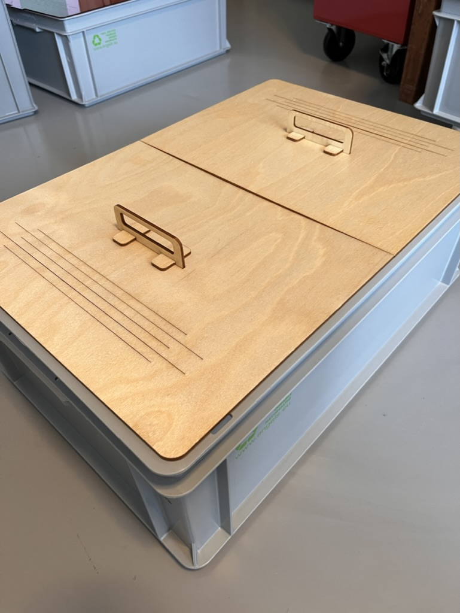
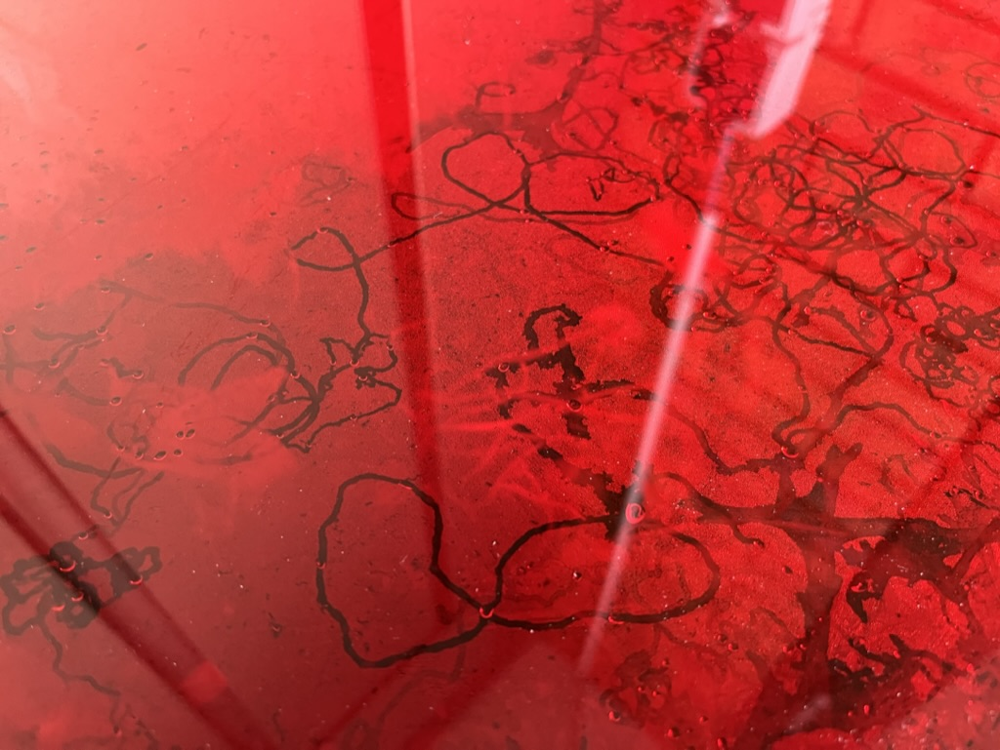
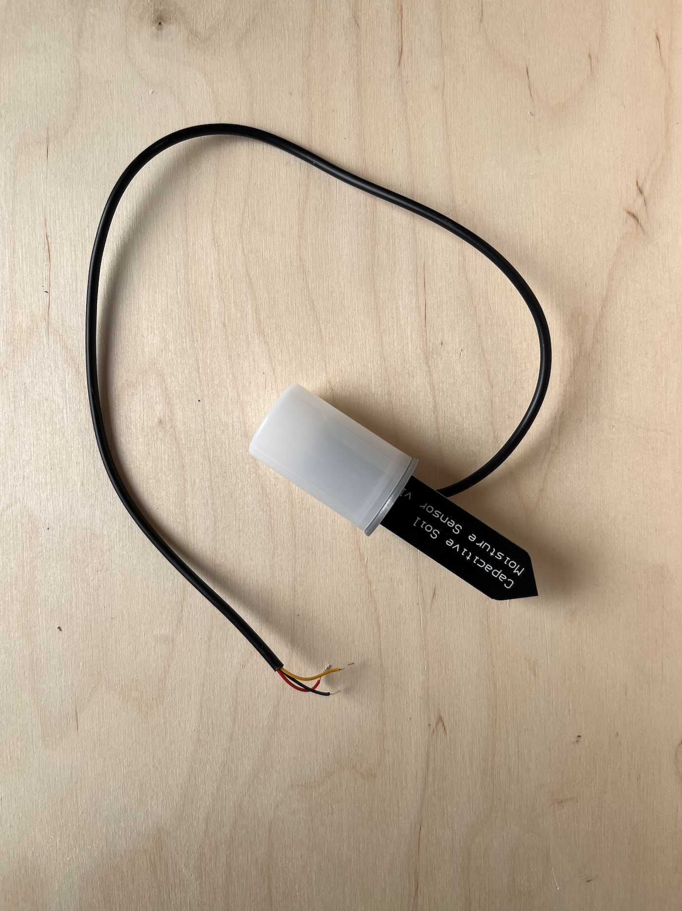
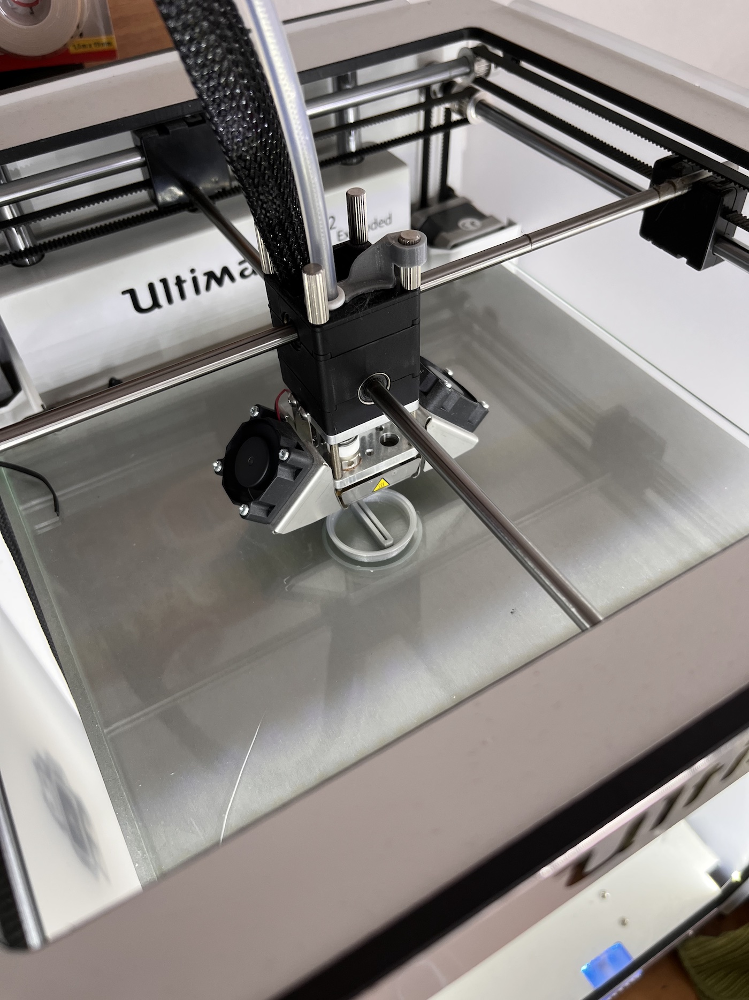

# WiggleBin Build

The following are steps to build our third prototype version WiggleBin V0.0.3.

## Box

### Materials
- Wood or acrylic
- Eurobox
- Oil 

### Tools
- Laser cutter

### Notes

The build for this box is open to variation. The container is a single bin worm bin made from a eurobin. The top has two lids for easy access. 

> When placing the bin inside you might want to tape off the holes with Micropore tape and add clamps to prevent worms crawling out

Vector file for lasercutting can be found in `Design/LaserCutLid`.

The lid has been oiled four times with Danish oil (with 4 hours in between) in the hope to make the Birch wood more durable and stain resistant. The oil can be applied with (paper) cloth. Make sure to read the safety instruction when using oil, since it can be a fire hazard.

### Improvements

- Using waterproof multiplex
- Enforce lid mid section 
- Air holes should be small strips instead of long stripes
- Connect and lock with square holes available in eurobox
- Make hinge with holes available in eurobox

### Alternatives

We also made some prototypes out of other materials.

*Acrylic*

Acrylic has the advantage of being to able to view the inside of the worm bin. The disadvantage is that acrylic traps moist in the worm bin. 

Another interesting side effect is that the tracks of worms on the lid become visible.

*Cedar wood*

Cedar wood has many properties which make it great for a worm bin. This type is light and durable.

 

## Waterproofing Soil Sensor

The soil sensor comes without protection for the circuit board. On the internet you can find many ideas for waterproofing the sensor, from nailpolish to epoxy. 

We came up with the idea of re-using a film roll case. Which provides a more elegant look and makes the sensor replacable in case of breakage.

> **Warning**
> This case is not 100% waterproof. To make it more waterproof you might want to add some hotglue in the right places. However for the worm bin we think the case is enough (time will tell).

> **Warning**
> Inserting the sensor trough the cap can damage the sensor. We still need to make some improvements to the design.

### Materials
- Wire 
- Soil sensor
- Film roll case

### Tools
- 3D printer
- Soft hamer
- Small screwdriver (for re-opening the case when needed)
- Pliers
- Soldering station

3D files for Raspberry Pico holder with breadboard are available in 

Print the bottle cap with a 3D printer. You can download the 3D files in `Design/SoilSensorWaterProofCap`.

Take off the white connector from the soil sensor with some pliers. This will reveal additional holes. 

Place the sensor and wire into the 3D printed cap. The 3D print is designed to be super tight around the sensor and wire. Use a soft hammer to apply some pressure and kindly jam the sensor in.

Solder the wire to the sensor using the 3 holes in at the back of the sensor. 

|  |  | 
|-|-|

Place the cap on the film bottle, enjoy the snapping sound, and you're done 😅.