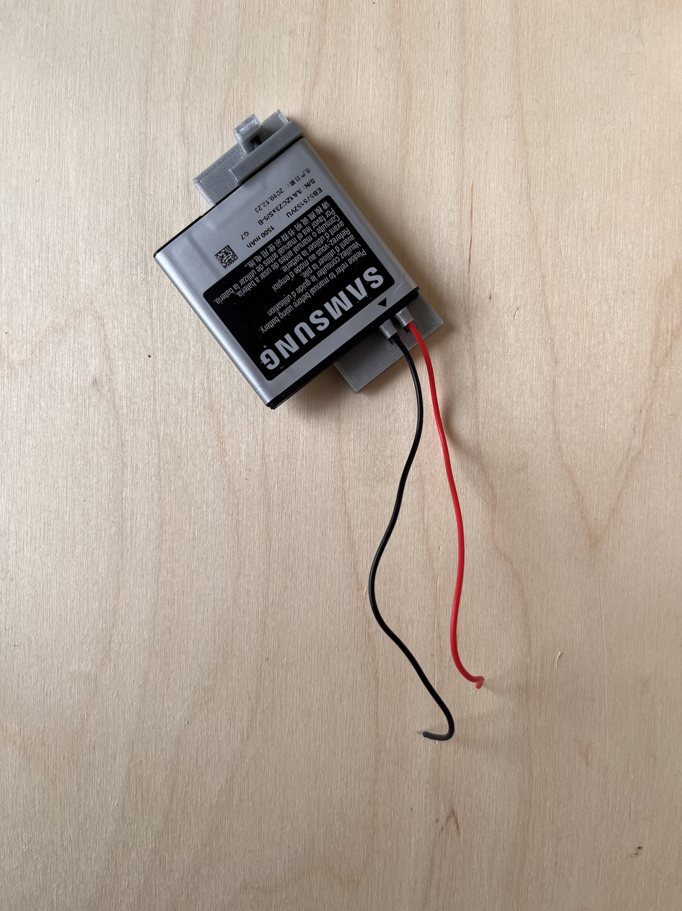
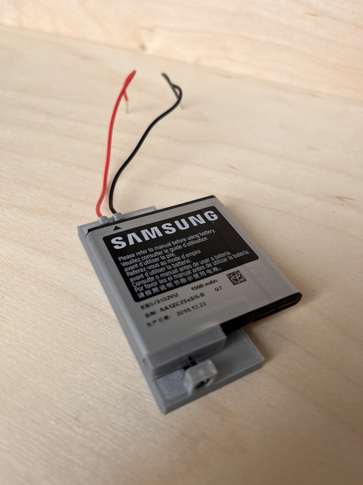

# WiggleBin Electronics


## WiggleCentral and Monitor

### Materials
- [Raspberry Pico W](https://www.tinytronics.nl/shop/en/development-boards/microcontroller-boards/with-wi-fi/raspberry-pi-pico-w-rp2040) or ESP device
- Raspberry Pi to run [Home Assistant](https://www.home-assistant.io) and collect data

### Home Assistant and EspHome

The Raspberry Pi with [Home Assistant](https://www.home-assistant.io) installed acts as a home to collect and display sensor info. Home Assistant can also trigger alerts when a sensor passes a certain value, perfect for detecting unhappy worms.

Follow the [Home Assistant start guide](https://www.home-assistant.io/installation/) to set up a Home Assistant station.

After installing Home Assistant follow the [ESPHome start guide](https://esphome.io/guides/getting_started_hassio.html).

## WiggleMonitor

The core of the WiggleMonitor is an Raspberry Pico W which is connected to multiple sensors and actuators.

This complete YAML config is available at [Code/EspHome/wigglemonitor.yam](Code/EspHome/wigglemonitor.yaml).


### WiggleMonitor Soil Sensor

The WiggleMonitor Soil Sensor measures the soil temperature and moisture.

- [Capacitive Soil Moisture sensor](https://www.tinytronics.nl/shop/en/sensors/liquid/capacitive-soil-moisture-sensor-module-with-cable). Make sure to buy a [good one](https://www.youtube.com/watch?v=IGP38bz-K48).
- [1MΩ resistor](https://www.tinytronics.nl/shop/en/components/resistors/resistors/1m%CF%89-resistor)
- [DS18B20 TO-92 Thermometer](https://www.tinytronics.nl/shop/en/sensors/temperature/ds18b20-to-92-thermometer-temperature-sensor-with-cable-waterproof-high-temperature-1m) (soil temperature)
- [DS18B20 Adapter](https://www.tinytronics.nl/shop/en/sensors/temperature/ds18b20-adapter) or 4.7kΩ resistor

| Pico | Sensor
--- | --- | 
| GPIO26 | Capacitive Soil Moisture sensor
| GPIO6 | DS18B20
| 3V3(Out) | 
| GND | 


Fritzing file is available in [Design/WiggleBinSoilSensor/WiggleBinSoilSensor.fzz](Design/WiggleBinSoilSensor/WiggleBinSoilSensor.fzz)

Add the following to the config of your WiggleMonitor in EspHome. 

Make sure to configure the right settings for `calibrate_linear` in the Soil Moisture config. Measure the soil sensor when it is fully submerged in water and when completely dry. 

```yaml
dallas:
  - pin: GPIO6

sensor:
  - platform: dallas
    address: 0xe401131e5ee12a28
    name: "WiggleMonitor Soil Temperature"
  - platform: adc
    id: soil_moisture
    pin: GPIO26
    name: "WiggleMonitor Soil Moisture"
    unit_of_measurement: "%"
    accuracy_decimals: 1
    update_interval: 20s
    filters:
    - median:
        window_size: 7
        send_every: 4
        send_first_at: 1
    - calibrate_linear:
        - 1.48 -> 100.00
        - 2.8 -> 0.00
    - lambda: |
        if (x < 0) return 0; 
        else if (x > 100) return 100;
        else return (x);
```

### WiggleMonitor Light

Having a light in the WiggleMonitor can be handy for monitoring the worm bin via the camera or when feeding the worms. Worms are sensitive to light, but are okay with red and infrared light. Therefore this unit uses a red LED.

- High power LED
- Q1S8050 NPN Transistor
- 10kΩ resistor
- 1kΩ resistor

| Pico | 
--- | 
| GPIO27 |
| 3V3(Out) | 
| GND | 


Fritzing file is available in [Design/WiggleBinLight/WiggleBinLight.fzz](Design/WiggleBinLight/WiggleBinLight.fzz)

Add the following to the config of your WiggleMonitor in EspHome.

```yaml
light:
  - platform: monochromatic
    name: "WiggleMonitor Light"
    output: wiggleMonitorLight
    default_transition_length: 0s

output:
  - platform: rp2040_pwm
    id: wiggleMonitorLight
    pin: GPIO27
```

### WiggleMonitor Air Sensor

The BME680 sensor is used to measure things like temperature and moisture in the air. The BME680 is available via I2C at address 0x77.

- [BME680 sensor](https://www.tinytronics.nl/shop/en/sensors/air/pressure/bme680-sensor-module-with-level-converter-air-pressure-air-quality-humidity-temperature)

|Pico | BME680 sensor|
--- | --- | 
| 3V3(Out) | VCC |
| GND | GND |
| GP4 | SDA |
| GP5 | SCL |

Add the following to the config of your WiggleMonitor in EspHome.

```yaml
esphome:
  name: "wigglemonitor"

sensor:
  - platform: bme680
    temperature:
      name: "WiggleMonitor Air Sensor"
      oversampling: 16x
    pressure:
      name: "WiggleMonitor Air Pressure"
    humidity:
      name: "WiggleMonitor Air Humidity"
    address: 0x77
```

## WiggleCamera

### Materials
- [M5Stack Timer Camera F - Fisheye](https://www.tinytronics.nl/shop/en/platforms-and-systems/m5stack/camera/m5stack-timer-camera-f-fisheye) or Raspberry Pico W or ESP device
- [M5STACK FlashLight Unit - AW3641](https://www.tinytronics.nl/shop/en/platforms-and-systems/m5stack/unit/m5stack-flashlight-unit-aw3641)


To film our worms in action we use a M5Stack camera. 

We also need a flashlight, be aware that worms are sensitive to light, do not overuse the flashlight. For longer viewing use a red light or infrared camera.

The complete YAML config is available at [Code/EspHome/wigglecamera.yam](Code/EspHome/wigglecamera.yaml).

The camera might be blurry, since the focus is set to one meter or more. To fix this, open up the M5Stack camera and adjust the distance of the lens from the sensor.

> It is possible to use the M5 stack camera for gathering sensor data as well, instead of using both a Raspberri Pico W and M5 stack camera. However things get a bit more complicated. See [./Build-Electronics-I2C.md](./Build-Electronics-I2C.md)

```yaml
esphome:
  name: "wigglecamera"

esp32:
  board: esp32dev
  framework:
    type: arduino

i2c:
  sda: GPIO4
  scl: GPIO13
  scan: True

output:
  - platform: ledc
    id: WiggleMonitorFlashLight
    pin: GPIO4

light:
  - platform: monochromatic
    name: "WiggleMonitor Flash Light"
    output: WiggleMonitorFlashLight
    default_transition_length: 0s
    
esp32_camera:
  external_clock:
    pin: GPIO27
    frequency: 20MHz
  i2c_pins:
    sda: GPIO25
    scl: GPIO23
  data_pins: [GPIO32, GPIO35, GPIO34, GPIO5, GPIO39, GPIO18, GPIO36, GPIO19]
  vsync_pin: GPIO22
  href_pin: GPIO26
  pixel_clock_pin: GPIO21
  reset_pin: GPIO15
  contrast: 1
  brightness: 1
  name: WiggleMonitor Camera
```


## WiggleMonitor Outdoor

Because the WiggleMonitor will usually be placed outside in the garden or balcony we will eventually add the option to make it battery powered. This chapter is however work in progress.

Now batteries are not great for nature (chemicals and such). Therefore we created an experimental adapter which can be 3D printed and holds multiple types of batteries re-used from that old phone in your cabinet.

The 3D files for this can be found in `Design/WiggleBin/BatteryHolder`.

Wire the wires trough the holes and tighten the battery in with a bolt.

> **Warning**
> Batteries can be dangerous. Please be careful and only proceed when you have enough electronics experience. Otherwise use a battery supply off the shelf of an electronics store or a 5V wall adapter.

|  |  | 
|-|-|